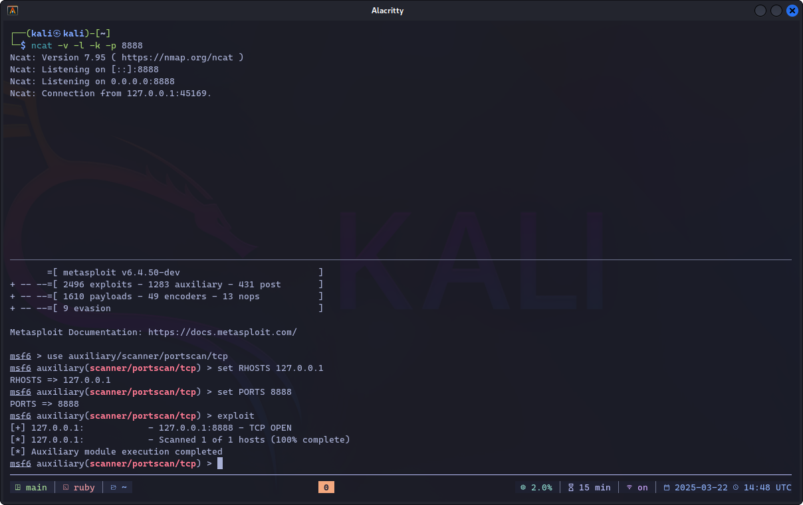

# kali-ctf-machine-setup



This repo contains Ansible playbooks to install extra tools on top of Kali Linux for CTF (Capture The Flag) and pentest activities.

These tools are useful when playing CTF on platforms such as [Hack The Box](https://www.hackthebox.com/), [TryHackMe](https://tryhackme.com/), etc.

## Howto?

### 0. Setup Kali Linux

It is assumed that you have a plain vanilla installation of Kali Linux. This README is tailored for [Kali virtual machine images](https://www.kali.org/get-kali/#kali-virtual-machines)

### 1. Upgrade packages

This step is optional as the Ansible playbook takes care of it. However, it is highly recommended to upgrade all installed packages at this stage to avoid issues later.

```zsh
sudo apt update
sudo apt full-upgrade -y
```

### 2. Install git and ansible-core

```zsh
sudo apt update
sudo apt install git ansible -y

# Only if the ansible package is NOT available, install ansible-core and the required collections below
sudo apt install ansible-core -y
# Install the additional ansible collections (do not use `sudo` here)
ansible-galaxy collection install ansible.posix \
  community.general \
  community.docker \
  community.crypto
```

### 3. Clone this repo

```zsh
git clone https://github.com/fazlearefin/kali-ctf-machine-setup.git
cd kali-ctf-machine-setup
```

### 4. Run the Ansible playbook to install the extra tools

Enter the password for the user (`kali`) when prompted (your user ID might be different if it is a custom installation).

Run one of the commands below depending on whether you want the vulnerable Docker images to be pulled or not.

#### Install WITHOUT Docker vulnerable images

```zsh
ansible-playbook -vv -i localhost, -e "{ setup_vuln_docker_images: false }" -e "local_username=$(id -un)" -K main.yml
```

#### Install WITH Docker vulnerable images

```zsh
ansible-playbook -vv -i localhost, -e "{ setup_vuln_docker_images: true }" -e "local_username=$(id -un)" -K main.yml
```

### 5. Further customizations (optional)

Further customizations to the installation can be done by running the command below:

```zsh
kali-tweaks
```

---

## Bundled Docker Vulnerable Images

*Docker vulnerable images* are Docker containers running deliberately vulnerable services. The following vulnerable images are installed so that you can practice within your own Kali installation:

- [OWASP Juice Shop](https://owasp.org/www-project-juice-shop/)
- [OWASP WebGoat](https://owasp.org/www-project-webgoat/)

### Running the vulnerable Docker images

#### OWASP Juice Shop

```zsh
docker run --rm -d -p 3000:3000 --name juice-shop bkimminich/juice-shop
# Use a web browser to go to http://localhost:3000 in the Kali host
```

#### OWASP WebGoat

```zsh
docker run --rm -it -p 127.0.0.1:8080:8080 -p 127.0.0.1:9090:9090 -e TZ=UTC --name webgoat webgoat/webgoat
# Use a web browser to go to http://127.0.0.1:8080/WebGoat in the Kali host
```

#### DVWA (Damn Vulnerable Web Application)

```zsh
sudo systemctl start dvwa
# Navigate to http://localhost:42001
# Default creds are admin:password
# Security level can be changed in `/etc/dvwa/config/config.inc.php`
```

---

## Additional Git Repos

Additional Git repos are cloned locally at the following locations:

- [`/opt/GitTools`](https://github.com/internetwache/GitTools): A repository with 3 tools for pwning websites with exposed `.git` directories
- [`/opt/zphisher`](https://github.com/htr-tech/zphisher): An automated phishing tool with 30+ templates
- [`/opt/vulhub`](https://github.com/vulhub/vulhub): Pre-built vulnerable environments based on Docker Compose
- [`/opt/privesc-scripts/LinEnum`](https://github.com/rebootuser/LinEnum): Scripted local Linux enumeration & privilege escalation checks
- [`/opt/privesc-scripts/linux-exploit-suggester`](https://github.com/The-Z-Labs/linux-exploit-suggester): Linux privilege escalation auditing tool
- [`/opt/privesc-scripts/linux-smart-enumeration`](https://github.com/diego-treitos/linux-smart-enumeration): Linux enumeration tool for pentesting and CTFs with verbosity levels
- [`/opt/privesc-scripts/PEASS-ng`](https://github.com/carlospolop/PEASS-ng): PEASS - Privilege Escalation Awesome Scripts SUITE (with colors)
- [`/opt/WEF`](https://github.com/D3Ext/WEF): Wi-Fi Exploitation Framework

---

## Kali Linux Useful Links

- [Kali Tools](https://www.kali.org/tools/)
- [Kali Linux Metapackages](https://www.kali.org/tools/kali-meta/)
- [Kali's Default Credentials](https://www.kali.org/docs/introduction/default-credentials/)

## Other Useful Links

- **[HackTricks](https://book.hacktricks.xyz/)** ⭐
- **[HackTricks Cloud](https://cloud.hacktricks.xyz/)** ⭐
- [OWASP Cheat Sheet Series](https://cheatsheetseries.owasp.org/)
- [OWASP Web Security Testing Guide](https://owasp.org/www-project-web-security-testing-guide/latest/)
- [Payloads All The Things](https://swisskyrepo.github.io/PayloadsAllTheThings/)
- [GTFOBins](https://gtfobins.github.io/)
- [CyberChef](https://gchq.github.io/CyberChef/) – Encode/decode data
- [CrackStation](https://crackstation.net/) – Hash rainbow list
- [Reverse Shell Generator](https://www.revshells.com/)
- [CI/CD Goat](https://github.com/cider-security-research/cicd-goat)
- [h4cker](https://github.com/The-Art-of-Hacking/h4cker)
- [PortSwigger Web Security Academy](https://portswigger.net/web-security/all-materials)
- [Recommended WiFi Adapters for Kali Linux](https://github.com/morrownr/USB-WiFi/blob/main/home/Recommended_Adapters_for_Kali_Linux.md)

---

## Donations

If you think my work helped you in some way and saved you time and effort, I’m happy to receive any amount of donation. However, the code in this repo is completely free.

Bitcoin (BTC): `bc1qzlhpm94vtk2ht67etdutzcy2g5an5v6g36tp0m`
